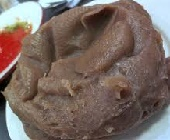
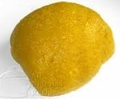
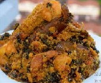
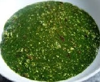

AMALA PROJECT - Nigerian Dish Predictor

An Image Classification project. 

We consider 6 meal classes.

1. FUFU
2. EBA
3. AMALA
4. EFO
5. EWEDU
6. IYAN 

using keras and tensorflow.

 




## Files

1. data - contains all images for model development
2. markdown_images - contains all images for the readme file.
3. models - contains all Neural Network models.

predict.py - runs model prediction on images
encoder.py - trains label encoder for model training

model_development.ipynb: data preparation and model development

## Predict

To make predictions on new images, simply run:

```bash
pip install -r requirements.txt
```

```bash
python predict.py
```
